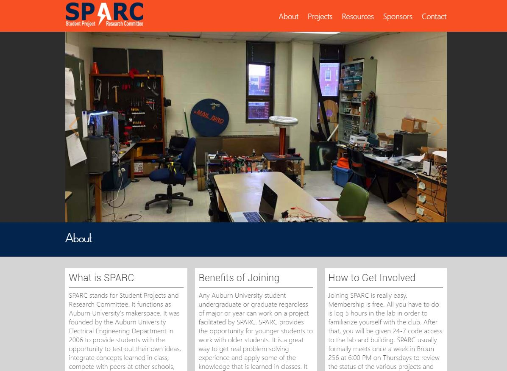

# SPARC-Auburn.github.io
http://sparc-auburn.github.io/   
</img>
<h3>Overview</h3>
The website is composed entirely of HTML, CSS, Javascript, and JQuery.  The website is based off of the flat graphic style and is set up as a single page for ease of navigation and simplicity.  The main content is contained in index.html.  The main styling is contained in css/style.css.  

<h3>How to add Projects to the SPARC Website</h3>
Under the project section of our website we have a list of various different projects we are working on or have worked on.  In order to make it easier for those who are not experienced in web development to add projects to the website we use Github to feed the project section.  Below are 3 simple steps to add your repository to the Github: 

Step 1: add a text file named "addrepositorytowebsite.txt" with the text "Adds this repository to the SPARC website." to the repository. 
Step 2: add a general overview of the repository to the description in Github (Descriptions should be about 2-4 sentences) 
Step 2: (optional but recommended) add a picture of the project with the name "websitephoto.jpg" (Remember Github is case sensitive) 

<b>Project Initiation Date:</b> 2/15/16</b>

